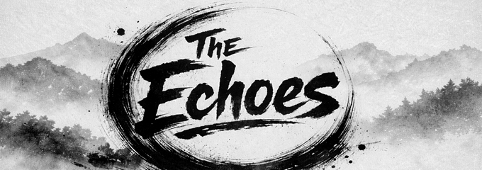
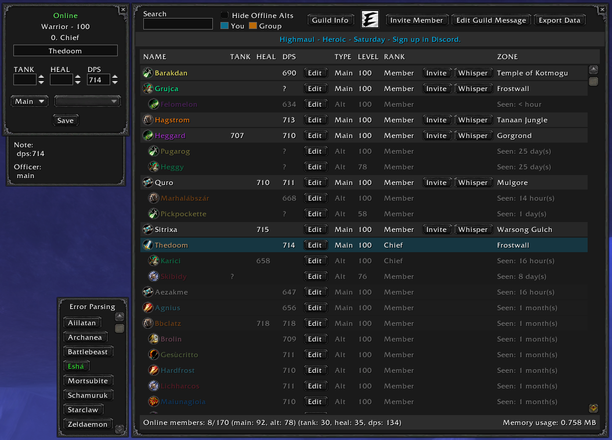

 
<code>Version: 2.3</code>
<code>WoW Client Version: 7.3.5 (Legion)</code>

The Echoes addon is a guild manager which is offering a better view/management.

<b><u>
The addon is using the public and officer notes to manage the data of character.
</u></b>

Features:

<ul>
<li>Button(movable) to toggle the UI.</li>
<li>Key binding for toggling the UI - in key bindings, category The Echoes.</li>
<li>Show the item level per role.</li>
<li>Nested Alts.</li>
<li>Invite / Whisper buttons.</li>
<li>Edit user notes with an easy-use panel (edit available only for mods).</li>
<li>Private note per member.</li>
<li>Colored row for the members from the group.</li>
<li>Setting to show group members a top.</li>
<li>Search function.</li>
<li>Show the guild message.</li>
<li>Guid info - Read and edit(if you have access), with option to copy text.</li>
<li>Invite member & Edit Guild Message - available only for mods.</li>
<li>Stats - Bottom of UI</li>
<li>Export - function to export the data of all members into a file.</li>
</ul>

If you have any suggestion or found a bug, feel free to create an issue on GitHub.

