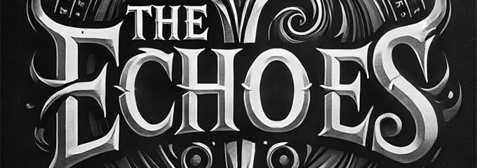
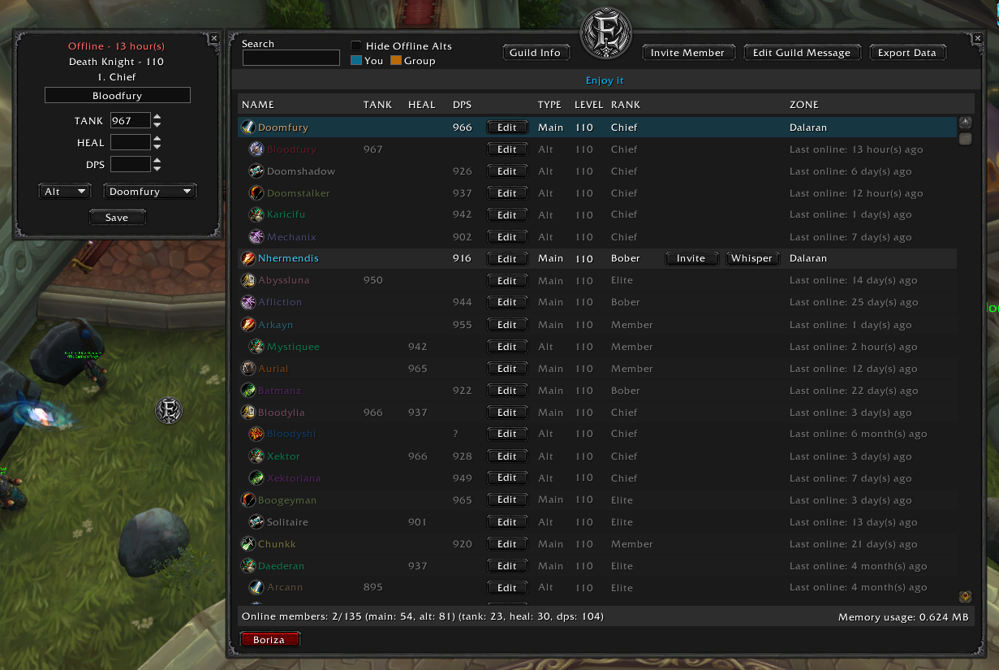

 
<code>Version: 2.2</code>
<code>WoW Client Version: 7.3.5 (Legion)</code>

The Echoes addon is a guild manager which is offering a better view/manage of the members.

<u>The addon is using the public and officer notes to manage the data of character.</u>

Features:

<ul>
<li>Button(movable) to toggle the UI</li>
<li>Key binding for toggling the UI - in key bindings, category The Echoes</li>
<li>Show the item level per role</li>
<li>Nested Alts</li>
<li>Invite / Whisper buttons</li>
<li>Edit user notes with an easy-use panel - available only for mods</li>
<li>Easy to fix the notes of unparsed members (broken notes) - these members appears at the bottom of UI and the notes can be visible in edit panel.</li>
<li>Colored row for the members from the group</li>
<li>Search member - if you search a main, it will show the alts too, if you search an alt it will show the main too</li>
<li>Show the guild message</li>
<li>Guid info - Read and edit(if you have access), with option to copy text</li>
<li>Invite new member - available only for mods</li>
<li>Edit Guild Message - available only for mods</li>
<li>Export the data of all members - JSON format, and includes only the members with parsable notes.</li>
<li>Stats - Bottom of UI</li>
</ul>

Author: raul1ro (discord)

If you have any suggestion or found a bug, feel free to type me, or create an issue on GitHub.

